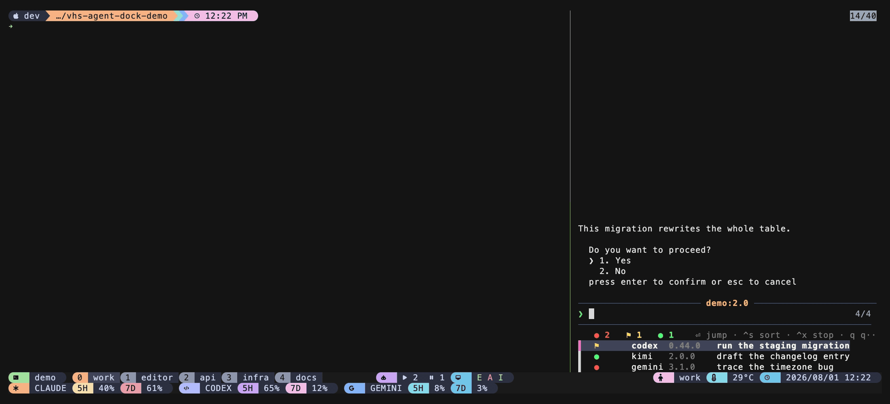
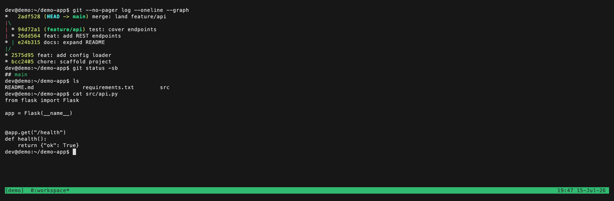

# tmux-agent-dock

> 中文說明請見 [docs/zh.md](docs/zh.md)


**macOS-primary.** The scan is plain tmux and portable in principle, but the
process-tree handling in the stop action and every classifier signal below were
verified on macOS only. Linux almost certainly works; nothing on Linux has been
asserted. Tested on **tmux next-3.8**, fzf 0.73.1, 2026-08.


*Every agent on this tmux server in one sidebar, newest-attention first, with the selected one's live screen above. Recorded against forged agents; see [§10](#10-about-the-recording).*

---

## 1. What is this?

One key opens a **dock** — a full-height sidebar on the right edge of the
current window that lists every AI-CLI pane running anywhere on this tmux
server, live. Move the cursor and the top of the dock shows that agent's screen;
press ⏎ to jump to it, `⌃x` to stop it.

It answers "which of my agents is waiting on me, which is still working, and
which is idle" without cycling through windows to look.

There is **no daemon**. The dock finds agents by scanning tmux directly —
`list-panes` for the panes, `capture-pane` for each one's screen — and reads the
state (working / waiting / idle) from that screen, exactly the way
[tmux-agent-status](https://github.com/operonlab/tmux-agent-status) does for its
status-line capsule. Nothing runs in the background, nothing is stored, nothing
leaves the machine.

**Detected agents:** claude, codex, gemini, aider, cursor, agy, copilot,
opencode, amp, droid, qwen, kimi, hermes, pi, grok — any pane whose command is
one of those, plus a `node`/`bun`/`deno` pane whose terminal title marks it as
an agent. Adding one is a single word in `scripts/rows.sh` and `classify.awk`.

---

## 2. Quickstart

### Path A — I don't use a plugin manager (works right now)

```sh
git clone https://github.com/operonlab/tmux-agent-dock ~/.tmux/plugins/tmux-agent-dock
echo "run-shell ~/.tmux/plugins/tmux-agent-dock/agent-dock.tmux" >> ~/.tmux.conf
tmux source-file ~/.tmux.conf
```

Then press **prefix + A**.

### Path B — I use TPM (the tmux plugin manager)

Add to `~/.tmux.conf`, above the `run '~/.tmux/plugins/tpm/tpm'` line:

```tmux
set -g @plugin 'operonlab/tmux-agent-dock'
```

Press **prefix + I** to install, then **prefix + A** to open the dock.

---

## 3. Keys

| key | what it does |
|-----|--------------|
| prefix + A | open the dock; press again to close it |
| ↑ ↓ / type | move / filter the list; the preview follows the selection |
| ⏎ | jump to the selected agent's pane |
| ⌃s | cycle the sort: attention → tool |
| ⌃x | stop the selected agent — `p` its process (pane stays), `k` the whole pane, `c` cancel |
| q | close the dock |

"Attention" order puts what needs you first: waiting, then idle, then working
(leave a working agent alone). The pane you are attached to is marked `▸`.

---

## 4. Demo



Move down the list and the preview follows: the agent waiting on you, the idle
one, the two still working. ⏎ jumps to it, `⌃x` stops it.

---

## 5. Options

| option | default | what it does |
|--------|---------|--------------|
| `@agent-dock-bind` | `A` | prefix key that toggles the dock. `none` disables the binding. |
| `@agent-dock-width` | `27%` | dock width — a percentage or an absolute column count. |
| `@agent-dock-lang` | `en` | UI language; `zh` switches the runtime strings to Traditional Chinese. |

Environment variables, for calling the scripts outside tmux:

| variable | default | what it does |
|----------|---------|--------------|
| `AGENT_DOCK_LANG` | `en` | same as `@agent-dock-lang` |
| `AGENT_DOCK_VCACHE` | `~/.cache/tmux-agent-dock/versions.tsv` | where the CLI-version cache lives |

---

## 6. Uninstall

```sh
bash ~/.tmux/plugins/tmux-agent-dock/scripts/teardown.sh
```

Removes the binding and closes the dock pane. Add `--purge-cache` to also delete
`~/.cache/tmux-agent-dock`. Your `@agent-dock-*` config lines are left alone, and
no agent pane is ever touched. Then remove the `@plugin` / `run-shell` line and
reload tmux.

---

## 7. Troubleshooting / FAQ

**prefix + A does nothing.** Check the binding exists: `tmux list-keys | grep
agent-dock`. If the dock opens but is empty, you have no agent panes the scanner
recognises — run `bash ~/.tmux/plugins/tmux-agent-dock/scripts/rows.sh
--no-color` to see what it finds.

**An agent I'm running is missing.** The scanner keys on
`pane_current_command`. Some launchers wrap the CLI so the command shows as
`node`/`bun`; those are only picked up when the terminal title marks them. Open
an issue with the `pane_current_command` value (`tmux list-panes -a -F
'#{pane_current_command}'`).

**A pane shows the wrong state.** State is read from the pane's visible screen
by `classify.awk`, shared with tmux-agent-status; its
[detection matrix](https://github.com/operonlab/tmux-agent-status/blob/main/docs/detection-matrix.md)
lists the per-CLI signals. A scrolled-away screen can read as `unknown`.

**Is anything sent anywhere?** No. The only network call is a `curl` to
`127.0.0.1` that refreshes the fzf list in place; that port is protected by a
per-run `FZF_API_KEY`.

**What it does not show, that the private original did:** a precise
time-in-state, listening ports, or the specific reason an agent is waiting.
Those came from a stateful daemon; a stateless scan cannot reconstruct them.

---

## 8. How it works (one paragraph)

`scripts/rows.sh` runs `tmux list-panes -a`, keeps the panes whose command is an
agent, captures each one's screen and passes it to `classify.awk` for a
working / waiting / idle verdict, then prints one coloured TSV row per agent
(newest-attention first). `scripts/dock.sh` pipes that into fzf: the preview is
`tmux capture-pane` of the selected agent (`{2}:{3}` = session:target), ⏎ jumps,
`⌃x` stops. A 2-second ticker re-runs the scan through fzf's `--listen` port so
the list and header stay live. That port accepts arbitrary commands, so the dock
generates a per-run `FZF_API_KEY` and fzf rejects any request without it. Every
fzf placeholder is kept **bare** so fzf quotes it — a pane or session named
`$(...)` is displayed, never executed.

---

## 9. Requirements

| requirement | why | if missing |
|-------------|-----|------------|
| tmux ≥ 1.9 | `@`-prefixed options, `capture-pane -p` | plugin will not load |
| fzf ≥ 0.43 | `--listen` with `$FZF_PORT`, and `FZF_API_KEY` to secure it | 0.38–0.42 has `--listen` but no API key and is unsupported |
| awk, ps | the classifier and the process-stop action | core, always present |
| curl | the 2-second in-place refresh | list still works, just no auto-refresh |

---

## 10. About the recording

The images above were recorded against **forged agents**: `docs/demo-fixture.sh`
compiles a tiny native binary that prints a canned screen and blocks, so its
`pane_current_command` reads `claude`/`codex`/… without any real CLI, and
`docs/demo-setup.sh` stages four of them on an isolated tmux server.

That is not decoration. The dock puts agent titles and live screens on screen,
so a recording made against a real machine would publish whatever you were
working on.

The keystroke labels are drawn on after the fact: vhs records the screen but not
the keys, so the arrow-and-⏎ navigation would otherwise look like it happens by
itself. `docs/keycast.py` overlays them from the timings in `docs/demo.tape`.
Re-record in two steps: `vhs docs/demo.tape`, then `python3 docs/keycast.py`.

---

## Part of the [operonlab](https://github.com/operonlab) tmux family

Small, focused plugins that compose into one cockpit. Bare tmux **before**, the
family **after**:



Mix and match whichever you like:

| plugin | what it adds |
|--------|--------------|
| [tmux-workdesk](https://github.com/operonlab/tmux-workdesk) | one-key IDE + tile/main pane layouts |
| [tmux-floatpane](https://github.com/operonlab/tmux-floatpane) | a pop-up floating scratch terminal |
| [tmux-context-menu](https://github.com/operonlab/tmux-context-menu) | a right-click / prefix menu of pane actions |
| [tmux-autosize](https://github.com/operonlab/tmux-autosize) | auto-resize background windows to the client |
| [tmux-passthrough](https://github.com/operonlab/tmux-passthrough) | pass a key straight through to the inner app |
| [tmux-sysmon](https://github.com/operonlab/tmux-sysmon) | live CPU / MEM / DISK / NET capsules |
| [tmux-llm-usage](https://github.com/operonlab/tmux-llm-usage) | LLM quota / spend as a status capsule |
| [tmux-agent-status](https://github.com/operonlab/tmux-agent-status) | busy / blocked / idle AI-pane capsule |
| [tmux-agent-resume](https://github.com/operonlab/tmux-agent-resume) | replay each AI CLI to its exact session after a crash |
| [tmux-agent-history](https://github.com/operonlab/tmux-agent-history) | browse every AI CLI's chat history in one list |
| [tmux-pillbar](https://github.com/operonlab/tmux-pillbar) | build a second status row of custom pills |
| **tmux-agent-dock** — you are here | a live sidebar of every agent pane: jump, watch, stop |

## Credits / License

MIT. See [LICENSE](LICENSE). The three-state classifier (`classify.awk`) is
shared with [tmux-agent-status](https://github.com/operonlab/tmux-agent-status).
